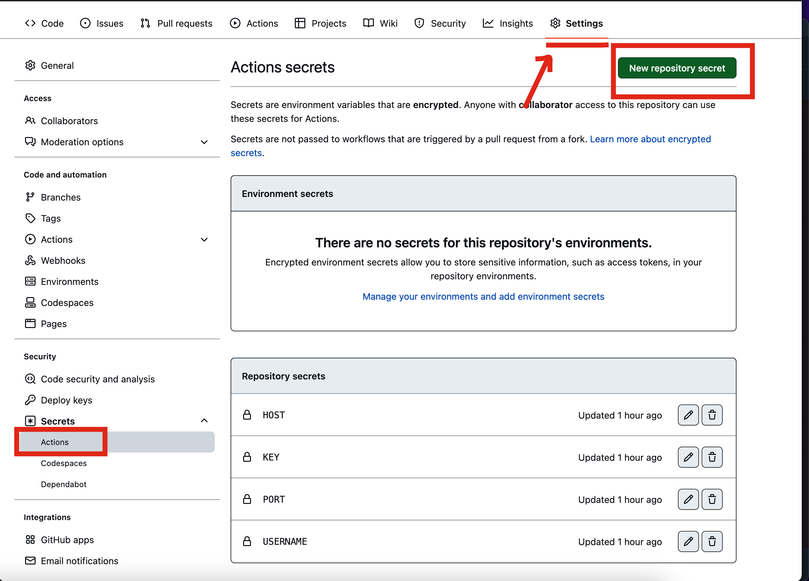

# gatus-deployer
Manage your https://gatus.io/ configuration from git repo.

## Usage:

### Use as template

Click the use as a template button.

### Buy a VPS

Get a cheapo VPS from any hosting provider. The cost should not be any higher than 5 euros. Hosting providers:

- Contabo
- Hetzner
- OVH
- DigitalOcean
- Linode
- Vultr

### Create secrets

Server access information is fetched from secrets.

Go to `Settings` -> `Secrets` -> `Actions` -> `Add new repository secret`

You have to create four (4) secrets.

**HOST:** *This is the IP address of the server or domain (that resolves to the server IP). Server has to have an SSH server running.*
**USERNAME:** *SSH username (most often root, ubuntu or debian). User must have a root/sudo access.*
**KEY:** *SSH private key (generate with `ssh-keygen`). Add this to the server on `~/.ssh/authorized_keys` folder (most hosting services can do this on server creation too)*
**PORT:** *SSH server port (pretty much always 22)*

Helpful picture:

### Initialize server

Server needs to have `docker` and `docker-compose` installed. This can be done with *Initalize server (install Docker)* action.

Go to `Actions` -> `Initalize server (install Docker)` -> `Run workflow (branch is master if questioned)`

Helpful picture:

### Add your own Gatus config

Edit [docker-compose.yml](./gatus/docker-compose.yml:20) (line 20) to contain the status page domain. Make sure that there is also a DNS record pointing to the host with the status page domain as a key.

[config.yaml](./gatus/config/config.yaml) contains the Gatus config ([docs](https://github.com/TwiN/gatus#configuration)). The configuration is written in yaml but it can also be JSON if you want (easier for machines to update if needed).

Adding multiple servers requires a bit of hackeroo with configs and docker-compose. The configuration from `./gatus` is copied to `/opt/docker-services/gatus`. On every new redeployment the `/opt/docker-services` is deleted (do not store anything important there and use named volumes in docker-composes).